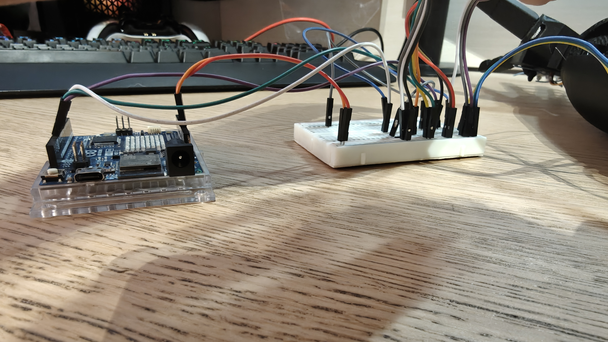

:Author: The Army
:Email: thearmy.hope@gmail.com
:Date: 14/01/2025
:Revision: version#1
:License: Apache 2.0

= Project: Robotic Arm - Arm part

This project is about a robotic arm that gets controlled by a glove via Wi-Fi.
This 3D printed arm, is big enough to contain several servomotors that will rotate based on the glove's arduino's incoming data to the arm's one:

 * The rotation of 3 of them will pull strings attached to several fingers, making them _"flex"_.
 * The rotation of one of them will make the wrist rotate horizzontally.
 * The rotation of a mini servo will make the thumb rotate horizzontally.
3 fingers were conjoined for a stronger grip.

== Step 1: Installation
1. Download this sketch or use Arduino CLoud directly [RECOMMENDED to use at best this Sketch as Thing]
2. Configure your Wi-Fi credentials and sync the degrees variables among the Arm and Glove Things
3. Attach your Arm arduino board to this sketch

== Step 2: Print the 3D components, put them together and assemble the circuit
**NOTE:** In these tests the _palm_ and _wrist_ were **not** used.

image::circuit-up-all.jpg["Circuit, complete upper POV"]
image::circuit-up.jpg["Circuit, upper POV"]

== Step 3: Load the code
Upload the code contained in this sketch on to your board.

=== Folder structure
....
 arm                      => Arduino sketch folder
  ├── arm.ino             => main Arduino file
  ├── arduino_secrets.h   => credentials or other secrets configuration file
  ├── sketch.json         => Arduino sketch configuration file (mainly for Arduino Cloud)
  ├── thingProperties.h   => Arduino sketch auto-generated properties file (code related)
  ├── circuit-up.all.jpg  => complete upper POV image of the Arm's circuit
  ├── circuit-up.jpg      => upper POV image of the Arm's circuit
  ├── circuit-lateral.jpg => lateral POV image of the Arm's circuit
  └── ReadMe.adoc         => this file
....

=== License
This project is released under an Apache 2.0 License.

=== Contributing
To contribute to this project you can make Pull Requests to its repository.

=== BOM
At the moment, the total amount for the Arm is 80€ circa and you'll also need a 3D printer.
Besides the big 3D arm and finger pieces, strings, a breadboard and pin male/female cables, you'll also need some specific parts:
|===
| ID | Part name             | Part number | Quantity
| S1 | 15kg Servomotors pack | B0C4T73SMB  | 1 (4 if not as pack)
| S2 | Mini Servomotor       | B0BBR4RB5H  | 1                   
| R4 | Arduino UNO R4 WiFi   | ABX00087    | 1                   
|===

=== Help
If you need help you can use the _Issue_ tab inside of this repository.

This document is written in the _AsciiDoc_ format, a markup language to describe documents.
If you need help you can search the http://www.methods.co.nz/asciidoc[AsciiDoc homepage]
or consult the http://powerman.name/doc/asciidoc[AsciiDoc cheatsheet]
