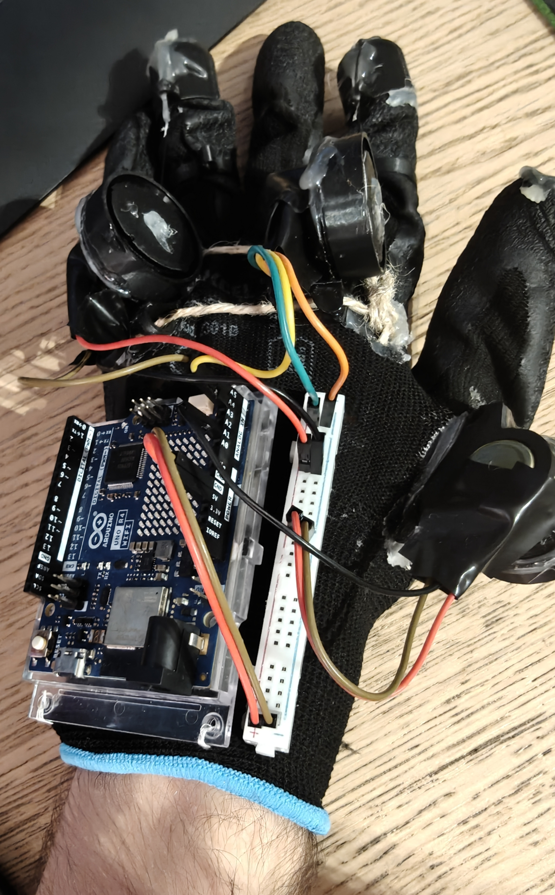
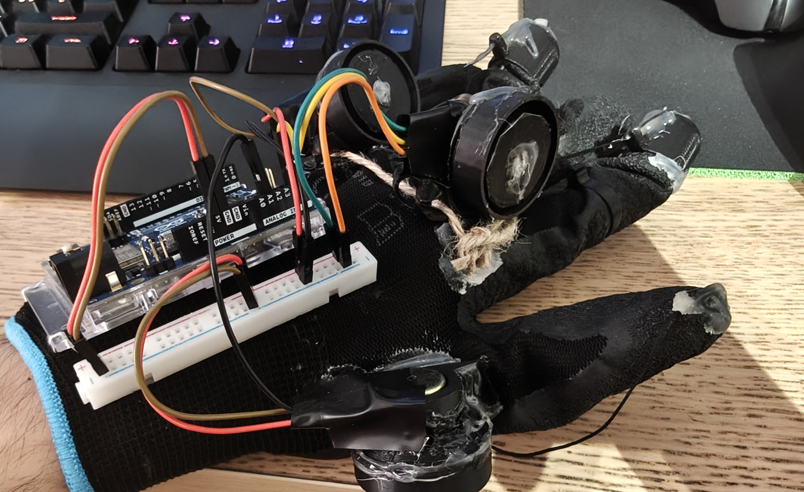

:Author: The Army
:Email: thearmy.hope@gmail.com
:Date: 14/01/2025
:Revision: version#1
:License: Apache 2.0

= Project: Robotic Arm - Glove part

This project is about a glove that controls a robotic arm via Wi-Fi.
This glove is the base for attaching an arduino board and a breadbord with 4 potentiometers and a flex sensor.
Each component has its specific role:

 * 3 potentiometers will get the different fingers' angles while another one will get the wrist's side rotation. The more the fingers flex or the wrist rotates, the more the potentiometers will rotate aswell thanks to the strings; they will return to their original position using a spring attached to them inside a printed 3D model socket.
 * The flex sensor mounted internally on the thumb will get the thumb's side flex.
 * All of this data is collected by the glove's arduino that will send these degrees values to the arm's arduino through Arduino Cloud.
3 fingers were conjoined for a stronger grip.

== Step 1: Installation
1. Download this sketch or use Arduino CLoud directly [RECOMMENDED to use at best this Sketch as Thing]
2. Configure your Wi-Fi credentials and sync the degrees variables among the Arm and Glove Things
3. Attach your Glove arduino board to this sketch

== Step 2: Print the 3D components, put them together and assemble the circuit
**NOTE:** In these tests the _palm_ and _wrist_ were **not** used.

== Step 3: Load the code
Upload the code contained in this sketch on to your board.

=== Folder structure
....
 glove                    => Arduino sketch folder
  ├── glove.ino           => main Arduino file
  ├── arduino_secrets.h   => credentials or other secrets configuration file
  ├── sketch.json         => Arduino sketch configuration file (mainly for Arduino Cloud)
  ├── thingProperties.h   => arduino sketch auto-generated properties file (code related)
  ├── circuit-up.jpg      => upper POV image of the Glove's circuit
  ├── circuit-lateral.jpg => lateral POV image of the Glove's circuit
  └── ReadMe.adoc         => this file
....

=== License
This project is released under an Apache 2.0 License.

=== Contributing
To contribute to this project you can make Pull Requests to its repository.

=== BOM
At the moment, the total amount for the Glove is 100€ circa and you'll also need a 3D printer and hot glue.
Besides a generic glove, a metallic piece for making springs, https://github.com/The-Army-Hope/RemoteArm/tree/main/assets[3D pieces] to place the springs with the potentiometers, strings, a little breadboard and pin male/female cables, you'll also need some specific parts:
|===
| ID | Part name               | Part number | Quantity
| P1 | 10k Potentiometers pack | B0D6XZ2875  | 2 (4 or 5 if not as pack, depends if you'd like to do the elbow too)
| F1 | 500g Flex Sensor        | B08B88W3H5  | 1                                                                   
| R4 | Arduino UNO R4 WiFi     | ABX00087    | 1                                                                   
|===

=== Help
If you need help you can use the _Issue_ tab inside of this repository.

This document is written in the _AsciiDoc_ format, a markup language to describe documents.
If you need help you can search the http://www.methods.co.nz/asciidoc[AsciiDoc homepage]
or consult the http://powerman.name/doc/asciidoc[AsciiDoc cheatsheet]
